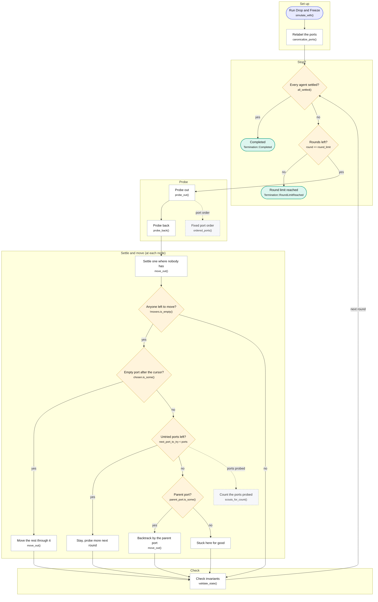
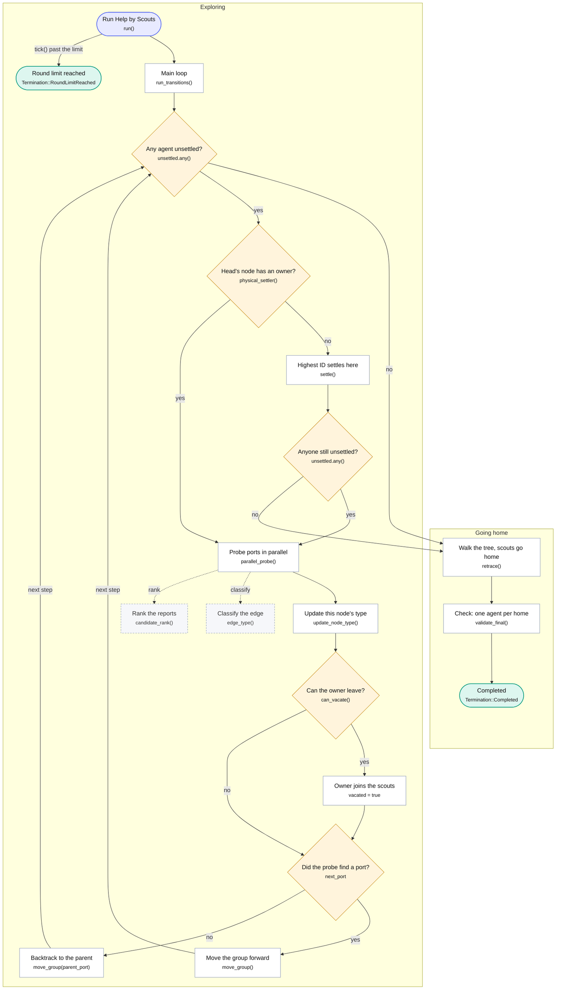
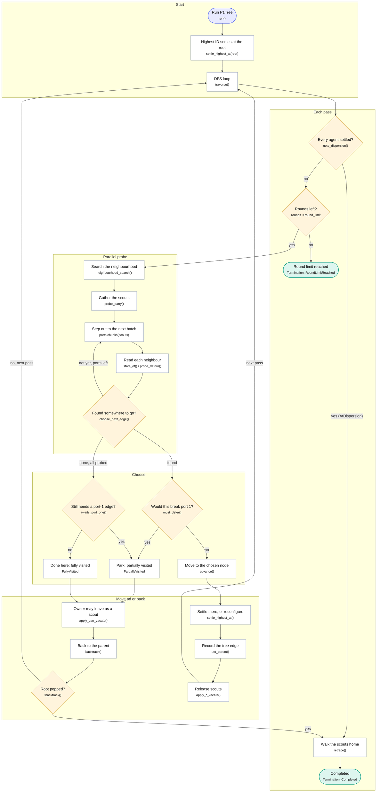

# Algorithm flowcharts

One flowchart per algorithm, with the code of every function the chart names.

The charts are the control flow as implemented, not as idealised: where the
implementation departs from a paper, the chart shows what the code does and the
notes say why. Read [behavior-spec.md](behavior-spec.md) for Drop-and-Freeze and
Help-by-Scouts, and [p1tree.md](p1tree.md) for P1Tree, before drawing
conclusions from any of them. The interactive version, [`docs.html`](../docs.html),
explains every box and opens its code.

> Generated by [`scripts/gen-flowcharts.sh`](../scripts/gen-flowcharts.sh) from
> the chart data in [`crates/ccm-docgen/src/spec.rs`](../crates/ccm-docgen/src/spec.rs),
> which also generates `docs.html`. The code blocks are extracted from the
> crates, so editing this file by hand will be overwritten. Re-run the script
> after changing a chart or any function it quotes.

Shapes: rounded = where a run starts or ends, rectangle = a step, diamond = a
question (its arrows are the answers), dashed = a helper the step calls.

## Contents

- [Drop and Freeze](#drop-and-freeze) — `ccm-algorithms`
- [Help by Scouts](#help-by-scouts) — `ccm-help-scouts`
- [P1Tree](#p1tree) — `ccm-p1tree`

---

## Drop and Freeze

Three phases per round, over the agents standing on each node. Unsettled agents fan out one per port to look at a neighbour, come back carrying one bit — does it have a settled agent — and then one of them settles where nobody has while the rest move on together through a port a probe reported empty. When every port has been tried the group backtracks through the settled agent's parent port, so the walk is a DFS whose tree is held by the settled agents.

It is meant for agents that all start on **one node**: from there, with no more agents than nodes, it always finishes. The code also accepts agents on several start nodes (as the Python reference did), but then a group can get stuck for good — see the notes.

`canonicalize_ports` is a compatibility decision rather than an algorithmic one: the Python reference replaced any supplied local port labels with canonical sorted-neighbour ones, so this port does too. It means Drop-and-Freeze ignores the port assignment the experiment asked for.



**Notes**

- **Several start nodes can stall the run.** "Empty" is read during the probe, and a start node's agent only settles later in the same round. So a group can move into another group's start node just as it becomes owned. Nobody settles there for this group, so it has no parent port to go back by: once that node's ports are used up, the group stays for good, and the run ends at the round limit with empty nodes left. Example: tree 0–1, 0–2, 1–3 with agents starting on 0, 0, 0 and 2 — two agents settle, two are stuck on node 2. The Python reference behaves the same way.
- No empty port does not always mean backtrack: the group stays and probes again next round whenever ports remain after the cursor that this round's probers (counting an agent that just settled) did not cover.
- "Empty" is read during the probe. In the same round a group standing on that neighbour may settle one of its agents there, so a group can move into a node that has just become owned.
- `validate_state` runs before the first round and after each of the three phases; the chart shows it once. A bad input, a failed traversal or a broken invariant returns an error instead of a result.
- Round limit: the rounds run as `1..=round_limit`. A run that settles in exactly the last round still ends Completed.

### Code

`simulate_with` — [crates/ccm-algorithms/src/lib.rs:354](https://github.com/drdebmath/CCMModel/blob/main/crates/ccm-algorithms/src/lib.rs#L354-L438)

```rust
/// Runs Drop-and-Freeze while allowing callers to provide a metrics sink and
/// recorder.  The algorithm itself never depends on either observer.
///
/// # Errors
///
/// Returns an error when the graph is invalid, a start node is outside the
/// graph, or an invariant fails during a transition.
pub fn simulate_with<M: Metrics, R: Recorder>(
    graph: &PortGraph,
    starts: &[NodeId],
    round_limit: u64,
    metrics: &mut M,
    mut recorder: R,
) -> Result<SimulationRun<R::Output>, DropAndFreezeError> {
    if starts.len() > u32::MAX as usize {
        return Err(DropAndFreezeError::TooManyAgents(starts.len()));
    }
    for &node in starts {
        if node.index() >= graph.node_count() {
            return Err(DropAndFreezeError::InvalidStart(node));
        }
    }

    // Python `_init_ports` replaces any supplied local labels with canonical
    // sorted-neighbor ports.  Normalize before executing the transition rules.
    let graph = canonicalize_ports(graph)?;
    let mut state = SimulationState {
        agents: starts
            .iter()
            .copied()
            .map(DropAgentState::unsettled)
            .collect(),
        settled_agent_at: vec![None; graph.node_count()],
        node_status: vec![DropNodeStatus::Empty; graph.node_count()],
    };

    validate_state(&graph, &state)?;
    observe(metrics, &state);
    recorder.record(FrameLabel::Start, &state);

    let metadata = SimulationMetadata {
        node_count: graph.node_count(),
        agent_count: state.agents.len(),
        round_limit,
    };

    let mut completed = all_settled(&state);
    for round in 1..=round_limit {
        if completed {
            break;
        }
        metrics.macro_round();
        metrics.logical_rounds(RoundKind::ProbeOut, 1);
        probe_out(&graph, &mut state, metrics);
        validate_state(&graph, &state)?;
        observe(metrics, &state);
        recorder.record(FrameLabel::ProbeOut { round }, &state);

        metrics.logical_rounds(RoundKind::ProbeBack, 1);
        probe_back(&graph, &mut state, metrics)?;
        validate_state(&graph, &state)?;
        observe(metrics, &state);
        recorder.record(FrameLabel::ProbeBack { round }, &state);

        metrics.logical_rounds(RoundKind::Movement, 1);
        move_out(&graph, &mut state, metrics)?;
        validate_state(&graph, &state)?;
        observe(metrics, &state);
        recorder.record(FrameLabel::MoveOut { round }, &state);

        completed = all_settled(&state);
    }

    let termination = if completed {
        Termination::Completed
    } else {
        Termination::RoundLimitReached { limit: round_limit }
    };
    Ok(SimulationRun {
        metadata,
        final_state: state,
        termination,
        trace: recorder.finish(),
    })
}
```

`canonicalize_ports` — [crates/ccm-algorithms/src/lib.rs:440](https://github.com/drdebmath/CCMModel/blob/main/crates/ccm-algorithms/src/lib.rs#L440-L451)

```rust
fn canonicalize_ports(graph: &PortGraph) -> Result<PortGraph, GraphError> {
    let mut edges = Vec::with_capacity(graph.edge_count());
    for source_index in 0..graph.node_count() {
        let source = NodeId(u32::try_from(source_index).expect("PortGraph node IDs fit in u32"));
        for (_, edge) in graph.ports(source) {
            if source < edge.neighbor {
                edges.push((source, edge.neighbor));
            }
        }
    }
    PortGraph::from_undirected_edges(graph.node_count(), &edges)
}
```

`all_settled` — [crates/ccm-algorithms/src/lib.rs:763](https://github.com/drdebmath/CCMModel/blob/main/crates/ccm-algorithms/src/lib.rs#L763-L768)

```rust
fn all_settled(state: &SimulationState) -> bool {
    state
        .agents
        .iter()
        .all(|agent| agent.status == DropStatus::Settled)
}
```

`probe_out` — [crates/ccm-algorithms/src/lib.rs:482](https://github.com/drdebmath/CCMModel/blob/main/crates/ccm-algorithms/src/lib.rs#L482-L537)

```rust
fn probe_out<M: Metrics>(graph: &PortGraph, state: &mut SimulationState, metrics: &mut M) {
    let (buckets, active) = occupancy(state);
    let mut moves = Vec::new();
    for node in active {
        let settled = state.settled_agent_at[node.index()];
        let mut unsettled: Vec<_> = buckets[node.index()]
            .iter()
            .copied()
            .filter(|&agent| {
                Some(agent) != settled
                    && state.agents[agent.index()].status == DropStatus::Unsettled
            })
            .collect();
        if unsettled.is_empty() {
            continue;
        }
        for &agent in &unsettled {
            let value = &mut state.agents[agent.index()];
            value.probe_home = None;
            value.probe_port = None;
            value.probe_result_empty = None;
        }
        if settled.is_none() && unsettled.len() == 1 {
            continue;
        }
        let ports = ordered_ports(graph, node);
        if ports.is_empty() {
            continue;
        }
        let start = settled.map_or(0, |agent| state.agents[agent.index()].next_port_to_try);
        if start >= ports.len() {
            continue;
        }
        unsettled.sort_unstable();
        for (agent, &port) in unsettled.iter().zip(ports[start..].iter()) {
            let Some(edge) = graph.traverse(node, port) else {
                continue;
            };
            let value = &mut state.agents[agent.index()];
            value.probe_home = Some(node);
            value.probe_port = Some(port);
            value.probe_result_empty = None;
            value.status = DropStatus::SettledWaiting;
            metrics.port_probe();
            metrics.probe_out_traversal();
            metrics.agent_moves(1);
            moves.push(ProbeMove {
                agent: *agent,
                destination: edge.neighbor,
            });
        }
    }
    for movement in moves {
        state.agents[movement.agent.index()].node = movement.destination;
    }
}
```

`ordered_ports` — [crates/ccm-algorithms/src/lib.rs:453](https://github.com/drdebmath/CCMModel/blob/main/crates/ccm-algorithms/src/lib.rs#L453-L465)

```rust
fn ordered_ports(graph: &PortGraph, node: NodeId) -> Vec<PortId> {
    let mut ports: Vec<(PortId, PortEdge)> = graph.ports(node).collect();
    ports.sort_by_key(|(port, edge)| {
        if port.0 != 0 && edge.remote_port.0 == 0 {
            (0_u8, port.0)
        } else if port.0 == 0 {
            (1_u8, port.0)
        } else {
            (2_u8, port.0)
        }
    });
    ports.into_iter().map(|(port, _)| port).collect()
}
```

`probe_back` — [crates/ccm-algorithms/src/lib.rs:539](https://github.com/drdebmath/CCMModel/blob/main/crates/ccm-algorithms/src/lib.rs#L539-L570)

```rust
fn probe_back<M: Metrics>(
    graph: &PortGraph,
    state: &mut SimulationState,
    metrics: &mut M,
) -> Result<(), DropAndFreezeError> {
    let mut moves = Vec::new();
    for index in 0..state.agents.len() {
        let agent =
            ccm_core::AgentId(u32::try_from(index).expect("agent IDs fit in the dense u32 domain"));
        if state.agents[index].status != DropStatus::SettledWaiting {
            continue;
        }
        let source = state.agents[index].node;
        state.agents[index].probe_result_empty =
            Some(state.settled_agent_at[source.index()].is_none());
        state.agents[index].status = DropStatus::Unsettled;
        if let Some(home) = state.agents[index].probe_home {
            let Some(port) = local_port_to(graph, source, home) else {
                return Err(DropAndFreezeError::Invariant(
                    InvariantViolation::InvalidTraversal,
                ));
            };
            metrics.probe_back_traversal();
            metrics.agent_moves(1);
            moves.push((agent, home, port));
        }
    }
    for (agent, destination, _incoming_port) in moves {
        state.agents[agent.index()].node = destination;
    }
    Ok(())
}
```

`move_out` — [crates/ccm-algorithms/src/lib.rs:572](https://github.com/drdebmath/CCMModel/blob/main/crates/ccm-algorithms/src/lib.rs#L572-L724)

```rust
#[allow(clippy::too_many_lines)]
fn move_out<M: Metrics>(
    graph: &PortGraph,
    state: &mut SimulationState,
    metrics: &mut M,
) -> Result<(), DropAndFreezeError> {
    let (buckets, active) = occupancy(state);
    let mut movers_by_node = vec![Vec::new(); state.node_status.len()];
    let mut active_with_movers = Vec::new();
    for node in active {
        let settled = state.settled_agent_at[node.index()];
        let movers: Vec<_> = buckets[node.index()]
            .iter()
            .copied()
            .filter(|&agent| {
                Some(agent) != settled
                    && state.agents[agent.index()].status == DropStatus::Unsettled
            })
            .collect();
        if !movers.is_empty() {
            active_with_movers.push(node);
            movers_by_node[node.index()] = movers;
        }
    }

    let mut newly_settled = vec![false; state.node_status.len()];
    for &node in &active_with_movers {
        if state.settled_agent_at[node.index()].is_some() {
            continue;
        }
        let agent = movers_by_node[node.index()].remove(0);
        let entry_pin = state.agents[agent.index()].entry_pin;
        let parent_port = entry_pin.filter(|&port| graph.traverse(node, port).is_some());
        state.agents[agent.index()].status = DropStatus::Settled;
        state.agents[agent.index()].parent_port = parent_port;
        state.agents[agent.index()].next_port_to_try = 0;
        state.settled_agent_at[node.index()] = Some(agent);
        state.node_status[node.index()] = DropNodeStatus::Occupied;
        newly_settled[node.index()] = true;
        metrics.settlement();
    }

    let mut planned = Vec::new();
    for &node in &active_with_movers {
        let movers = &movers_by_node[node.index()];
        if movers.is_empty() {
            continue;
        }
        let Some(settled) = state.settled_agent_at[node.index()] else {
            continue;
        };
        let ports = ordered_ports(graph, node);
        if ports.is_empty() {
            continue;
        }
        let cursor = state.agents[settled.index()].next_port_to_try;
        let mut scouts = movers.clone();
        if newly_settled[node.index()] {
            scouts.push(settled);
        }
        let mut empty_ports = Vec::new();
        for agent in scouts {
            let value = state.agents[agent.index()];
            if value.probe_home != Some(node) || value.probe_result_empty != Some(true) {
                continue;
            }
            let Some(port) = value.probe_port else {
                continue;
            };
            if graph.traverse(node, port).is_some() && !empty_ports.contains(&port) {
                empty_ports.push(port);
            }
        }
        empty_ports.sort_by_key(|port| {
            ports
                .iter()
                .position(|candidate| candidate == port)
                .unwrap_or(usize::MAX)
        });

        let chosen = empty_ports.iter().copied().find(|port| {
            ports
                .iter()
                .position(|candidate| candidate == port)
                .is_some_and(|index| index >= cursor)
        });
        if let Some(port) = chosen {
            let index = ports
                .iter()
                .position(|candidate| candidate == &port)
                .ok_or(DropAndFreezeError::Invariant(
                    InvariantViolation::InvalidTraversal,
                ))?;
            let edge = graph
                .traverse(node, port)
                .ok_or(DropAndFreezeError::Invariant(
                    InvariantViolation::InvalidTraversal,
                ))?;
            state.agents[settled.index()].next_port_to_try = index + 1;
            planned.push(MoveGroup {
                agents: movers.clone(),
                from: node,
                port,
                destination: edge.neighbor,
                backtrack: false,
            });
            continue;
        }

        let probed_count =
            scouts_for_count(state, node, movers, newly_settled[node.index()], settled);
        state.agents[settled.index()].next_port_to_try =
            core::cmp::min(ports.len(), cursor.saturating_add(probed_count));
        if state.agents[settled.index()].next_port_to_try < ports.len() {
            continue;
        }
        let Some(parent_port) = state.agents[settled.index()].parent_port else {
            continue;
        };
        let Some(edge) = graph.traverse(node, parent_port) else {
            continue;
        };
        state.agents[settled.index()].next_port_to_try = ports.len();
        planned.push(MoveGroup {
            agents: movers.clone(),
            from: node,
            port: parent_port,
            destination: edge.neighbor,
            backtrack: true,
        });
    }

    for group in planned {
        metrics.group_move(group.agents.len());
        if group.backtrack {
            metrics.backtrack();
        }
        metrics.agent_moves(group.agents.len() as u64);
        for agent in group.agents {
            let value = &mut state.agents[agent.index()];
            value.node = group.destination;
            let incoming = local_port_to(graph, group.destination, group.from).ok_or(
                DropAndFreezeError::Invariant(InvariantViolation::InvalidTraversal),
            )?;
            value.pin = Some(incoming);
            value.entry_pin = Some(incoming);
            value.probe_home = None;
            value.probe_port = None;
            value.probe_result_empty = None;
        }
    }
    Ok(())
}
```

`scouts_for_count` — [crates/ccm-algorithms/src/lib.rs:726](https://github.com/drdebmath/CCMModel/blob/main/crates/ccm-algorithms/src/lib.rs#L726-L755)

```rust
fn scouts_for_count(
    state: &SimulationState,
    node: NodeId,
    movers: &[ccm_core::AgentId],
    include_settled: bool,
    settled: ccm_core::AgentId,
) -> usize {
    let mut ports = Vec::<PortId>::new();
    for &agent in movers {
        let value = state.agents[agent.index()];
        if value.probe_home == Some(node) {
            if let Some(port) = value.probe_port {
                if !ports.contains(&port) {
                    ports.push(port);
                }
            }
        }
    }
    if include_settled {
        let value = state.agents[settled.index()];
        if value.probe_home == Some(node) {
            if let Some(port) = value.probe_port {
                if !ports.contains(&port) {
                    ports.push(port);
                }
            }
        }
    }
    ports.len()
}
```

`validate_state` — [crates/ccm-algorithms/src/lib.rs:789](https://github.com/drdebmath/CCMModel/blob/main/crates/ccm-algorithms/src/lib.rs#L789-L854)

```rust
fn validate_state(graph: &PortGraph, state: &SimulationState) -> Result<(), DropAndFreezeError> {
    if state.settled_agent_at.len() != graph.node_count()
        || state.node_status.len() != graph.node_count()
    {
        return Err(DropAndFreezeError::Invariant(
            InvariantViolation::OwnershipIndexMismatch,
        ));
    }
    for (index, agent) in state.agents.iter().enumerate() {
        if agent.node.index() >= graph.node_count() {
            return Err(DropAndFreezeError::Invariant(
                InvariantViolation::InvalidAgentNode,
            ));
        }
        if let Some(home) = agent.probe_home {
            if home.index() >= graph.node_count() {
                return Err(DropAndFreezeError::Invariant(
                    InvariantViolation::InvalidTraversal,
                ));
            }
        }
        if let Some(port) = agent.parent_port {
            if graph.traverse(agent.node, port).is_none() {
                return Err(DropAndFreezeError::Invariant(
                    InvariantViolation::InvalidParent,
                ));
            }
        }
        if let Some(owner) = state.settled_agent_at[agent.node.index()] {
            if owner
                == ccm_core::AgentId(
                    u32::try_from(index).expect("agent IDs fit in the dense u32 domain"),
                )
                && agent.status != DropStatus::Settled
            {
                return Err(DropAndFreezeError::Invariant(
                    InvariantViolation::OwnershipIndexMismatch,
                ));
            }
        }
    }
    for (node, owner) in state.settled_agent_at.iter().enumerate() {
        if let Some(agent) = owner {
            let Some(value) = state.agents.get(agent.index()) else {
                return Err(DropAndFreezeError::Invariant(
                    InvariantViolation::OwnershipIndexMismatch,
                ));
            };
            if value.node.index() != node || value.status != DropStatus::Settled {
                return Err(DropAndFreezeError::Invariant(
                    InvariantViolation::OwnershipIndexMismatch,
                ));
            }
            if state.node_status[node] != DropNodeStatus::Occupied {
                return Err(DropAndFreezeError::Invariant(
                    InvariantViolation::OwnershipIndexMismatch,
                ));
            }
        } else if state.node_status[node] != DropNodeStatus::Empty {
            return Err(DropAndFreezeError::Invariant(
                InvariantViolation::OwnershipIndexMismatch,
            ));
        }
    }
    Ok(())
}
```


---

## Help by Scouts

Also a DFS, but settled agents help. A settled agent whose node can spare it vacates and travels with the group as a scout, so more agents share the probing of a node's ports. When nobody is left unsettled, the scouts walk the tree depth first and each drops back onto its own node when the group reaches it, so the run ends with one settled agent on each occupied node.

Like the Python reference it is rooted: placements on several start nodes are not supported (a test records the reference's failure on them).



**Notes**

- The order inside a step matters: `can_vacate` reads the node type that `update_node_type` has just set from the probe reports.
- An owner that vacates joins this step's move and the next step's probe — not the probe already done.
- Only when `can_vacate` says the owner stays can it have released the parent node's owner — the root's included — into the group.
- A scout is not always out until the retrace: if the group comes back to its node and it may no longer leave, it settles back in there.
- Every step spends logical rounds through `tick()`, and so does each move of the retrace; the first one past the limit ends the run as RoundLimitReached. Backtracking at the root is an error (`MissingParent`).

### Code

`run` — [crates/ccm-help-scouts/src/lib.rs:488](https://github.com/drdebmath/CCMModel/blob/main/crates/ccm-help-scouts/src/lib.rs#L488-L506)

```rust
    fn run(mut self) -> Result<(HelpResult, M, R), HelpError> {
        let termination = match self.run_transitions() {
            Ok(()) => {
                self.validate_final()?;
                Termination::Completed
            }
            Err(HelpError::RoundLimit(limit)) => Termination::RoundLimitReached { limit },
            Err(error) => return Err(error),
        };
        Ok((
            HelpResult {
                termination,
                agents: self.agents,
                logical_steps: self.steps,
            },
            self.metrics,
            self.recorder,
        ))
    }
```

`run_transitions` — [crates/ccm-help-scouts/src/lib.rs:508](https://github.com/drdebmath/CCMModel/blob/main/crates/ccm-help-scouts/src/lib.rs#L508-L580)

```rust
    fn run_transitions(&mut self) -> Result<(), HelpError> {
        self.observe();
        while self.unsettled.iter().any(|&value| value) {
            self.metrics.macro_round();
            let active = self.active_ids();
            let head = *active
                .first()
                .ok_or(HelpError::Invariant("empty active set"))?;
            let node = self.agents[head.index()].node;
            let owner = if let Some(owner) = self.physical_settler(node, None) {
                owner
            } else {
                let to_settle = self.occupants[node.index()]
                    .iter()
                    .copied()
                    .filter(|id| self.unsettled[id.index()])
                    .max()
                    .ok_or(HelpError::MissingSettler(node))?;
                self.settle(to_settle, node, head)?;
                self.tick(1)?;
                to_settle
            };
            if !self.unsettled.iter().any(|&value| value) {
                break;
            }
            self.agents[head.index()].previous = Some(owner);
            let scouts = self.active_ids();
            let next_port = self.parallel_probe(node, owner, &scouts)?;
            self.observe();
            self.update_node_type(node, owner)?;
            let status = self.can_vacate(node, owner)?;
            self.agents[owner.index()].status = status;
            match status {
                HelpStatus::Settled => self.vacated[owner.index()] = false,
                HelpStatus::SettledScout => self.vacated[owner.index()] = true,
                HelpStatus::Unsettled => {}
            }
            let moving = self.active_ids();
            if let Some(port) = next_port {
                self.agents[owner.index()].recent_port = Some(port);
                self.agents[head.index()].child_port = Some(port);
                let destination = self.move_group(&moving, node, port)?;
                self.metrics.logical_rounds(RoundKind::Movement, 1);
                self.tick(1)?;
                if let Some(destination_owner) = self.physical_settler(destination, None) {
                    let arrival = self.agents[head.index()].arrival_port;
                    if self.agents[destination_owner.index()].node_type
                        == NodeType::PartiallyVisited
                        && arrival == Some(PortId(0))
                    {
                        self.agents[destination_owner.index()].parent = Some(owner);
                        self.agents[destination_owner.index()].port_at_parent = Some(port);
                        self.agents[destination_owner.index()].parent_port = arrival;
                        self.agents[destination_owner.index()].node_type = NodeType::Visited;
                        self.agents[destination_owner.index()].depth =
                            self.agents[owner.index()].depth.saturating_add(1);
                    }
                }
            } else {
                let parent_port = self.agents[owner.index()]
                    .parent_port
                    .ok_or(HelpError::MissingParent(node))?;
                self.agents[head.index()].child_port = None;
                self.agents[owner.index()].recent_port = Some(parent_port);
                self.move_group(&moving, node, parent_port)?;
                self.metrics.backtrack();
                self.metrics.logical_rounds(RoundKind::Movement, 1);
                self.tick(1)?;
            }
        }
        self.retrace()?;
        Ok(())
    }
```

`physical_settler` — [crates/ccm-help-scouts/src/lib.rs:193](https://github.com/drdebmath/CCMModel/blob/main/crates/ccm-help-scouts/src/lib.rs#L193-L200)

```rust
    fn physical_settler(&self, node: NodeId, exclude: Option<AgentId>) -> Option<AgentId> {
        self.occupants[node.index()].iter().copied().find(|&id| {
            Some(id) != exclude && matches!(self.agents[id.index()].status, HelpStatus::Settled)
                || (Some(id) != exclude
                    && self.agents[id.index()].status == HelpStatus::SettledScout
                    && self.agents[id.index()].home == Some(node))
        })
    }
```

`parallel_probe` — [crates/ccm-help-scouts/src/lib.rs:340](https://github.com/drdebmath/CCMModel/blob/main/crates/ccm-help-scouts/src/lib.rs#L340-L403)

```rust
    fn parallel_probe(
        &mut self,
        node: NodeId,
        owner: AgentId,
        scouts: &[AgentId],
    ) -> Result<Option<PortId>, HelpError> {
        let parent_port = self.agents[owner.index()].parent_port;
        let ports: Vec<PortId> = self
            .graph
            .ports(node)
            .map(|(port, _)| port)
            .filter(|&port| Some(port) != parent_port)
            .collect();
        self.agents[owner.index()].probe_results.clear();
        if !ports.is_empty() && scouts.is_empty() {
            return Err(HelpError::Invariant("no scouts available for probe"));
        }
        for batch in ports.chunks(scouts.len().max(1)) {
            for (index, &port) in batch.iter().enumerate() {
                let scout = scouts[index];
                let edge_type = self.edge_type(node, port)?;
                let destination = self.move_agent(scout, node, port)?;
                self.metrics.port_probe();
                self.metrics.scout_operation();
                self.metrics.probe_out_traversal();
                let owner_at_destination = self.home_owner[destination.index()];
                let node_type = owner_at_destination
                    .map_or(NodeType::Unvisited, |id| self.agents[id.index()].node_type);
                let return_port =
                    self.agents[scout.index()]
                        .arrival_port
                        .ok_or(HelpError::InvalidPort {
                            node: destination,
                            port,
                        })?;
                self.move_agent(scout, destination, return_port)?;
                self.metrics.probe_back_traversal();
                self.agents[owner.index()].probe_results.push(ProbeResult {
                    port,
                    edge_type,
                    node_type,
                    owner: owner_at_destination,
                });
            }
            self.metrics.logical_rounds(RoundKind::Scout, 2);
            self.tick(2)?;
        }
        self.agents[owner.index()]
            .probe_results
            .sort_unstable_by_key(|result| result.port);
        self.recorder.record_event(
            self.steps,
            SimulationEvent::PhaseStarted {
                phase: Phase::Scout,
            },
        );
        Ok(self.agents[owner.index()]
            .probe_results
            .iter()
            .copied()
            .min_by_key(|result| Self::candidate_rank(*result))
            .filter(|result| Self::candidate_rank(*result).0 != 99)
            .map(|result| result.port))
    }
```

`edge_type` — [crates/ccm-help-scouts/src/lib.rs:274](https://github.com/drdebmath/CCMModel/blob/main/crates/ccm-help-scouts/src/lib.rs#L274-L285)

```rust
    fn edge_type(&self, node: NodeId, port: PortId) -> Result<EdgeType, HelpError> {
        let edge = self
            .graph
            .traverse(node, port)
            .ok_or(HelpError::InvalidPort { node, port })?;
        Ok(match (port == PortId(0), edge.remote_port == PortId(0)) {
            (true, true) => EdgeType::OneOne,
            (false, true) => EdgeType::OtherOne,
            (true, false) => EdgeType::OneOther,
            (false, false) => EdgeType::OtherOther,
        })
    }
```

`candidate_rank` — [crates/ccm-help-scouts/src/lib.rs:322](https://github.com/drdebmath/CCMModel/blob/main/crates/ccm-help-scouts/src/lib.rs#L322-L338)

```rust
    fn candidate_rank(result: ProbeResult) -> (u8, u8, u16) {
        let node_rank = match result.node_type {
            NodeType::Unvisited => 0,
            NodeType::PartiallyVisited
                if matches!(result.edge_type, EdgeType::OtherOne | EdgeType::OneOne) =>
            {
                1
            }
            _ => 99,
        };
        let edge_rank = match result.edge_type {
            EdgeType::OtherOne => 0,
            EdgeType::OneOne | EdgeType::OneOther => 1,
            EdgeType::OtherOther => 2,
        };
        (node_rank, edge_rank, result.port.0)
    }
```

`update_node_type` — [crates/ccm-help-scouts/src/lib.rs:405](https://github.com/drdebmath/CCMModel/blob/main/crates/ccm-help-scouts/src/lib.rs#L405-L428)

```rust
    fn update_node_type(&mut self, node: NodeId, owner: AgentId) -> Result<(), HelpError> {
        let empty: Vec<ProbeResult> = self.agents[owner.index()]
            .probe_results
            .iter()
            .copied()
            .filter(|result| result.node_type == NodeType::Unvisited)
            .collect();
        if empty.is_empty() {
            self.agents[owner.index()].node_type = NodeType::FullyVisited;
        } else if let Some(parent_port) = self.agents[owner.index()].parent_port {
            if self.edge_type(node, parent_port)? == EdgeType::OtherOther
                && empty
                    .iter()
                    .all(|result| result.edge_type == EdgeType::OtherOther)
            {
                self.agents[owner.index()].node_type = NodeType::PartiallyVisited;
            } else {
                self.agents[owner.index()].node_type = NodeType::Visited;
            }
        } else {
            self.agents[owner.index()].node_type = NodeType::Visited;
        }
        Ok(())
    }
```

`can_vacate` — [crates/ccm-help-scouts/src/lib.rs:430](https://github.com/drdebmath/CCMModel/blob/main/crates/ccm-help-scouts/src/lib.rs#L430-L486)

```rust
    fn can_vacate(&mut self, node: NodeId, owner: AgentId) -> Result<HelpStatus, HelpError> {
        self.metrics.vacate();
        self.metrics.logical_rounds(RoundKind::Vacate, 2);
        self.tick(2)?;
        let state = self.agents[owner.index()].clone();
        if state.parent_port.is_none() {
            return Ok(HelpStatus::Settled);
        }
        if state.node_type == NodeType::Visited
            || (state.node_type == NodeType::FullyVisited && !state.vacated_neighbor)
        {
            let destination = self.move_agent(owner, node, PortId(0))?;
            let other = self.physical_settler(destination, Some(owner));
            if let Some(other) = other {
                self.agents[other.index()].vacated_neighbor = true;
            }
            let return_port =
                self.agents[owner.index()]
                    .arrival_port
                    .ok_or(HelpError::InvalidPort {
                        node: destination,
                        port: PortId(0),
                    })?;
            self.move_agent(owner, destination, return_port)?;
            self.metrics.logical_rounds(RoundKind::Vacate, 2);
            self.tick(2)?;
            return Ok(if other.is_some() {
                HelpStatus::SettledScout
            } else {
                HelpStatus::Settled
            });
        }
        if state.node_type == NodeType::PartiallyVisited {
            return Ok(HelpStatus::SettledScout);
        }
        if state.port_at_parent == Some(PortId(0)) {
            let parent_port = state.parent_port.ok_or(HelpError::MissingParent(node))?;
            let parent_node = self.move_agent(owner, node, parent_port)?;
            let parent_owner = self.physical_settler(parent_node, Some(owner));
            if let Some(parent_owner) = parent_owner {
                if self.agents[parent_owner.index()].vacated_neighbor {
                    self.move_agent(owner, parent_node, PortId(0))?;
                } else {
                    self.agents[parent_owner.index()].status = HelpStatus::SettledScout;
                    self.vacated[parent_owner.index()] = true;
                    let ids = [owner, parent_owner];
                    self.move_group(&ids, parent_node, PortId(0))?;
                    self.agents[owner.index()].vacated_neighbor = true;
                }
            } else {
                self.move_agent(owner, parent_node, PortId(0))?;
            }
            self.metrics.logical_rounds(RoundKind::Vacate, 2);
            self.tick(2)?;
        }
        Ok(HelpStatus::Settled)
    }
```

`retrace` — [crates/ccm-help-scouts/src/lib.rs:582](https://github.com/drdebmath/CCMModel/blob/main/crates/ccm-help-scouts/src/lib.rs#L582-L645)

```rust
    fn retrace(&mut self) -> Result<(), HelpError> {
        self.metrics.retrace();
        let mut vacated = self.active_ids();
        vacated.retain(|id| self.vacated[id.index()]);
        if vacated.is_empty() {
            return Ok(());
        }
        let mut tree = vec![Vec::<(NodeId, PortId)>::new(); self.graph.node_count()];
        for agent in &self.agents {
            if let (Some(home), Some(parent), Some(parent_port), Some(port_at_parent)) = (
                agent.home,
                agent.parent,
                agent.parent_port,
                agent.port_at_parent,
            ) {
                let parent_home = self.agents[parent.index()]
                    .home
                    .ok_or(HelpError::MissingParent(home))?;
                tree[home.index()].push((parent_home, parent_port));
                tree[parent_home.index()].push((home, port_at_parent));
            }
        }
        let start = self.agents[vacated[0].index()].node;
        let mut visited = vec![false; self.graph.node_count()];
        let mut stack = vec![(start, 0usize)];
        visited[start.index()] = true;
        self.settle_vacated_at(start);
        while !stack.is_empty() && self.vacated.iter().any(|&value| value) {
            let (node, index) = *stack.last().expect("stack non-empty");
            let next = tree[node.index()]
                .iter()
                .copied()
                .enumerate()
                .skip(index)
                .find(|(_, (neighbor, _))| !visited[neighbor.index()]);
            if let Some((edge_index, (neighbor, port))) = next {
                stack.last_mut().expect("stack non-empty").1 = edge_index + 1;
                let group = self.vacated_ids();
                self.move_group(&group, node, port)?;
                self.metrics.logical_rounds(RoundKind::Retrace, 1);
                self.tick(1)?;
                visited[neighbor.index()] = true;
                self.settle_vacated_at(neighbor);
                stack.push((neighbor, 0));
            } else {
                stack.pop();
                if let Some(&(parent, _)) = stack.last() {
                    let port = tree[node.index()]
                        .iter()
                        .find(|(neighbor, _)| *neighbor == parent)
                        .map(|(_, port)| *port)
                        .ok_or(HelpError::MissingParent(node))?;
                    let group = self.vacated_ids();
                    self.move_group(&group, node, port)?;
                    self.metrics.logical_rounds(RoundKind::Retrace, 1);
                    self.tick(1)?;
                }
            }
        }
        if self.vacated.iter().any(|&value| value) {
            return Err(HelpError::Invariant("retrace left vacated settlers"));
        }
        Ok(())
    }
```

`validate_final` — [crates/ccm-help-scouts/src/lib.rs:702](https://github.com/drdebmath/CCMModel/blob/main/crates/ccm-help-scouts/src/lib.rs#L702-L714)

```rust
    fn validate_final(&self) -> Result<(), HelpError> {
        let mut occupied = vec![false; self.graph.node_count()];
        for agent in &self.agents {
            if agent.status != HelpStatus::Settled || agent.home != Some(agent.node) {
                return Err(HelpError::Invariant("agent not settled at home"));
            }
            if occupied[agent.node.index()] {
                return Err(HelpError::DuplicateHome(agent.node));
            }
            occupied[agent.node.index()] = true;
        }
        Ok(())
    }
```


---

## P1Tree

`DFS_P1Tree` from Pattanayak, Kshemkalyani, Kumar, Molla and Sharma, *Optimal Dispersion Under Asynchrony*. A DFS that builds a **port-one tree**: in a finished tree every vertex has an incident tree edge carrying port 1 at one of its ends. Among the ports probed so far, edges are preferred `tp1 > t11 ~ t1q > tpq`; a node that would be left without a port-1 tree edge is parked as `partiallyVisited` until its port-1 neighbour comes to claim it.

Two details carry the `O(k)` bound, and losing either makes the cost scale with the graph instead of with the agents:

- `neighbourhood_search` **stops at the first batch that finds somewhere to go**. Remark 1 bounds the search by the agent count, not the degree: at most `k` nodes are ever occupied, so when the degree allows, an empty neighbour turns up within the first `k-1` probed ports at the root and `k-2` elsewhere.
- `traverse` **stops at dispersion**. Section 5: "the process continues until no unsettled agents remain". The tree at that moment need not yet be a P1Tree — a parked node may still hold a `tpq` parent edge — and that is fine, because dispersion is the goal.



**Notes**

- Because the search stops at the first batch that finds something, the edge preference only applies among the ports probed so far: a port-1 edge on a port not yet probed can lose to an earlier batch's choice.
- A node reached by a `tpq` edge is parked only when its next choice would be another `tpq` edge or it has no candidate at all; if a port-1 edge turns up among the ports probed, it advances instead.
- After a move, `apply_can_vacate` and `apply_parent_vacate` both look at the node just left: it is the new node's parent.
- A leaf (no ports but the parent's) or a search with nobody to probe skips the probe steps: the search returns nothing and the node goes straight to the "none, all probed" branch.
- "Every agent settled?" is the stop rule of `run()` and `simulate()` (`Stop::AtDispersion`). `run_to_full_tree` uses `Stop::AtFullTree`, whose only Completed exit is the root being popped (it can still stop at the round limit).

### Code

`run` — [crates/ccm-p1tree/src/lib.rs:465](https://github.com/drdebmath/CCMModel/blob/main/crates/ccm-p1tree/src/lib.rs#L465-L497)

```rust
    fn run(mut self) -> Result<(P1Result, M, R), P1Error> {
        self.checkpoint(Phase::Other);

        // Initialization (Section 4): the highest-ID agent present settles at
        // the root and the root becomes visited.
        self.settle_highest_at(self.head);
        self.node_type[self.head.index()] = NodeType::Visited;
        self.sync_node_type(self.head);
        self.checkpoint(Phase::Movement);

        let termination = self.traverse()?;
        // Section 5.1: put every travelling scout back on the node it owns, so
        // the run still ends one settled agent per node.
        if termination == Termination::Completed {
            self.retrace();
        }

        let tree = self.collect_tree();
        let agents = self.agents.clone();
        let logical_steps = self.step;
        let dispersed_at_step = self.dispersed_at_step;
        Ok((
            P1Result {
                termination,
                agents,
                tree,
                logical_steps,
                dispersed_at_step,
            },
            self.metrics,
            self.recorder,
        ))
    }
```

`settle_highest_at` — [crates/ccm-p1tree/src/lib.rs:871](https://github.com/drdebmath/CCMModel/blob/main/crates/ccm-p1tree/src/lib.rs#L871-L893)

```rust
    /// Section 4: "the agent with the highest ID among the unsettled agents at
    /// v settles".
    fn settle_highest_at(&mut self, node: NodeId) {
        let candidate = self
            .agents
            .iter()
            .enumerate()
            .filter(|(_, agent)| agent.status == P1Status::Unsettled && agent.node == node)
            .map(|(index, _)| index)
            .next_back();
        let Some(index) = candidate else {
            return;
        };
        let agent = &mut self.agents[index];
        agent.status = P1Status::Settled;
        agent.home = Some(node);
        agent.node_type = NodeType::Visited;
        agent.port_one_tree_edge = self.port_one_tree_edge[node.index()];
        self.settled_at[node.index()] = Some(AgentId(
            u32::try_from(index).expect("agent count fits the dense ID domain"),
        ));
        self.metrics.settlement();
    }
```

`traverse` — [crates/ccm-p1tree/src/lib.rs:499](https://github.com/drdebmath/CCMModel/blob/main/crates/ccm-p1tree/src/lib.rs#L499-L573)

```rust
    /// The `while S != {}` loop of Algorithm 2, with the stack realised by the
    /// parent pointers the settled agents hold.
    ///
    /// The loop runs until the root is popped, which is Algorithm 2's own
    /// termination. Stopping earlier, as soon as every agent had settled, left
    /// nodes `partiallyVisited` with a `tpq` parent edge and so broke
    /// Definition 1: it is exactly the walk back to the root that reconfigures
    /// them.
    fn traverse(&mut self) -> Result<Termination, P1Error> {
        let mut rounds = 0_u64;
        loop {
            self.note_dispersion();
            // Section 5: "The process continues until no unsettled agents
            // remain." Once the tree has k vertices the construction is done,
            // and Retrace follows. Walking on past this point to finish the
            // whole spanning tree is not what the algorithm does, and on a graph
            // whose degree far exceeds the agent count that walk is what made
            // the cost scale with n instead of k.
            if self.stop == Stop::AtDispersion && self.dispersed_at_step.is_some() {
                return Ok(Termination::Completed);
            }
            if rounds >= self.round_limit {
                return Ok(Termination::RoundLimitReached {
                    limit: self.round_limit,
                });
            }
            rounds += 1;
            self.metrics.macro_round();

            // With no unsettled agent left there is nobody to settle at an
            // unvisited node, so those neighbours are not candidates. The head
            // can still enter a partiallyVisited node to reconfigure it.
            let can_settle = self.unsettled_count() > 0;
            let results = self.neighbourhood_search(can_settle)?;
            let next = Self::choose_next_edge(&results, can_settle);

            if let Some(chosen) = next {
                if self.must_defer(chosen) {
                    // Algorithm 2, lines 21-23: taking a tpq edge would
                    // leave this node with no port-1 incident tree edge, so
                    // it waits to be claimed by its port-1 neighbour.
                    self.node_type[self.head.index()] = NodeType::PartiallyVisited;
                    self.sync_node_type(self.head);
                    self.apply_can_vacate(self.head);
                    self.checkpoint(Phase::Movement);
                    if !self.backtrack()? {
                        return Ok(Termination::Completed);
                    }
                } else {
                    self.advance(chosen)?;
                }
            } else {
                // Algorithm 2, line 29 marks a node with no candidate edge
                // fullyVisited. That alone is not enough: a node discovered
                // through a tpq edge that happens to have no empty
                // neighbours would finish with only a tpq tree edge and
                // break Definition 1. Claim 3 of the paper is explicit that
                // such a vertex "is immediately marked partiallyVisited and
                // DFS backtracks", so that its port-1 neighbour can reach it
                // later and reconfigure it. A node therefore only becomes
                // fullyVisited once it holds a port-1 incident tree edge.
                self.node_type[self.head.index()] = if self.awaits_port_one() {
                    NodeType::PartiallyVisited
                } else {
                    NodeType::FullyVisited
                };
                self.sync_node_type(self.head);
                self.apply_can_vacate(self.head);
                self.checkpoint(Phase::Movement);
                if !self.backtrack()? {
                    return Ok(Termination::Completed);
                }
            }
        }
    }
```

`neighbourhood_search` — [crates/ccm-p1tree/src/lib.rs:594](https://github.com/drdebmath/CCMModel/blob/main/crates/ccm-p1tree/src/lib.rs#L594-L700)

```rust
    /// Section 4.2's parallel probe: the scouts fan out over the head's ports
    /// together and come back reporting what they saw.
    ///
    /// Ports are handed to scouts in increasing agent-ID order. When there are
    /// at least as many scouts as ports the whole search is two rounds, out and
    /// back, which is the `O(1)`-epoch neighbourhood search the paper's bound
    /// rests on; with fewer scouts the assignment repeats until every port has
    /// been probed. The parent port is skipped, as in the paper: the parent is
    /// known to be occupied and is reached by backtracking, not by probing.
    ///
    /// The paper's rules (R1)-(R3) exist to tell an *empty* neighbour from a
    /// *vacated* one, which is ambiguous because a vacated node's settled agent
    /// has left it to travel as a scout. This implementation does not vacate
    /// (Section 4.1), so a node without a settled agent present is always empty
    /// and rule (R1) decides every case on its own.
    fn neighbourhood_search(&mut self, can_settle: bool) -> Result<Vec<ProbeResult>, P1Error> {
        let head = self.head;
        let degree = self.graph.degree(head).unwrap_or(0);
        let parent_port = self.parent[head.index()].map(|(_, port, _)| port);
        let ports: Vec<PortId> = (0..degree)
            .map(PortId)
            .filter(|port| Some(*port) != parent_port)
            .collect();
        let scouts = self.probe_party();
        let mut results = Vec::with_capacity(ports.len());
        if ports.is_empty() || scouts.is_empty() {
            return Ok(results);
        }

        for batch in ports.chunks(scouts.len()) {
            let moved = batch.len() as u64;

            self.metrics.logical_rounds(RoundKind::ProbeOut, 1);
            for (&port, &scout) in batch.iter().zip(scouts.iter()) {
                let edge = self
                    .graph
                    .traverse(head, port)
                    .ok_or(P1Error::InvalidPort { node: head, port })?;
                self.metrics.port_probe();
                self.metrics.probe_out_traversal();
                self.metrics.scout_operation();
                self.agents[scout].node = edge.neighbor;
                let state = self.state_of(edge.neighbor);
                // Rules (R2) and (R3): a scout that finds nobody home cannot yet
                // tell empty from vacated, and walks on to the port-1 neighbour
                // (and sometimes one further) to settle the question. The answer
                // is Lemma 5's, which is what the ownership index already holds,
                // but the walk is real and is charged here.
                let detour = self.probe_detour(edge.neighbor, edge.remote_port, state);
                for _ in 0..detour {
                    self.metrics.probe_out_traversal();
                    self.metrics.agent_moves(1);
                }
                results.push(ProbeResult {
                    port,
                    edge_type: EdgeType::of(port, edge.remote_port),
                    node_type: self.node_type[edge.neighbor.index()],
                    node_state: state,
                    owner: self.settled_at[edge.neighbor.index()],
                });
            }
            self.metrics.agent_moves(moved);
            self.checkpoint(Phase::ProbeOut);

            self.metrics.logical_rounds(RoundKind::ProbeBack, 1);
            for (&port, &scout) in batch.iter().zip(scouts.iter()) {
                let steps = self.graph.traverse(head, port).map_or(1, |edge| {
                    1 + self.probe_detour(
                        edge.neighbor,
                        edge.remote_port,
                        self.state_of(edge.neighbor),
                    )
                });
                for _ in 0..steps {
                    self.metrics.probe_back_traversal();
                }
                self.metrics.agent_moves(steps.saturating_sub(1));
                self.agents[scout].node = head;
            }
            self.metrics.agent_moves(moved);
            self.checkpoint(Phase::ProbeBack);

            // Stop as soon as a batch has turned up somewhere to go. Remark 1
            // of the paper bounds the search at "k-1 ports at the root node and
            // k-2 ports at a non-root node", not at the degree, and the reason
            // is pigeonhole: at most k nodes are ever occupied, so while any
            // agent is still unsettled some probed neighbour must be empty.
            //
            // Scanning every port instead made the cost scale with the degree
            // rather than with the agent count: 40 agents on a 4000-node
            // complete graph took 32357 rounds, where the DFS itself only made
            // 155 visits. The remaining ports are only worth probing when
            // nothing has been found, which is exactly the case that has to
            // rule out an empty neighbour before a node can be declared
            // finished.
            if Self::choose_next_edge(&results, can_settle).is_some() {
                break;
            }
        }

        if let Some(agent) = self.settled_at[head.index()] {
            self.agents[agent.index()]
                .probe_results
                .clone_from(&results);
        }
        Ok(results)
    }
```

`probe_party` — [crates/ccm-p1tree/src/lib.rs:1041](https://github.com/drdebmath/CCMModel/blob/main/crates/ccm-p1tree/src/lib.rs#L1041-L1065)

```rust
    /// The agents that travel to perform a neighbourhood search.
    ///
    /// Once every agent has settled there is no travelling group left, and
    /// Section 4 has the node's own settled agent do the search. The head then
    /// moves between nodes as a logical locus: the tree pointers already exist
    /// and each node's agent does its own local work, so no agent has to
    /// abandon the node it is settled at.
    fn probe_party(&self) -> Vec<usize> {
        let travelling: Vec<usize> = self
            .agents
            .iter()
            .enumerate()
            .filter(|(_, agent)| {
                matches!(agent.status, P1Status::Unsettled | P1Status::SettledScout)
            })
            .map(|(index, _)| index)
            .collect();
        if !travelling.is_empty() {
            return travelling;
        }
        // Nothing is travelling: the node's own settled agent probes for itself.
        self.settled_at[self.head.index()]
            .map(|agent| vec![agent.index()])
            .unwrap_or_default()
    }
```

`probe_detour` — [crates/ccm-p1tree/src/lib.rs:717](https://github.com/drdebmath/CCMModel/blob/main/crates/ccm-p1tree/src/lib.rs#L717-L735)

```rust
    /// How many extra edges a scout walks past the neighbour before it can
    /// answer, following rules (R1)-(R3).
    ///
    /// (R1) somebody is home, so no detour. (R2) nobody is home and the scout
    /// arrived on port 1, so the node is empty and no detour. (R3) otherwise the
    /// scout steps to the port-1 neighbour, and once more if that one is also
    /// deserted.
    fn probe_detour(&self, neighbor: NodeId, arrival_port: PortId, state: NodeState) -> u64 {
        if state == NodeState::Occupied || arrival_port == PORT_ONE {
            return 0;
        }
        let Some(first) = self.graph.traverse(neighbor, PORT_ONE) else {
            return 0;
        };
        if self.state_of(first.neighbor) == NodeState::Occupied || first.remote_port == PORT_ONE {
            return 1;
        }
        2
    }
```

`choose_next_edge` — [crates/ccm-p1tree/src/lib.rs:737](https://github.com/drdebmath/CCMModel/blob/main/crates/ccm-p1tree/src/lib.rs#L737-L755)

```rust
    /// Algorithm 2, lines 8-17: the highest-priority incident edge leading to a
    /// node the head may enter.
    ///
    /// A `PartiallyVisited` neighbour counts as empty exactly when this edge
    /// carries port 1 at that neighbour, which is rule (D4).
    fn choose_next_edge(results: &[ProbeResult], can_settle: bool) -> Option<ProbeResult> {
        let mut ordered: Vec<&ProbeResult> = results.iter().collect();
        ordered.sort_by_key(|result| (result.edge_type.priority(), result.port.0));
        ordered
            .into_iter()
            .find(|result| match result.node_type {
                NodeType::Unvisited => can_settle,
                NodeType::PartiallyVisited => {
                    matches!(result.edge_type, EdgeType::OtherOne | EdgeType::OneOne)
                }
                NodeType::Visited | NodeType::FullyVisited => false,
            })
            .copied()
    }
```

`must_defer` — [crates/ccm-p1tree/src/lib.rs:757](https://github.com/drdebmath/CCMModel/blob/main/crates/ccm-p1tree/src/lib.rs#L757-L768)

```rust
    /// Algorithm 2, line 21: the candidate and the parent edge are both `tpq`
    /// and this node has no port-1 incident tree edge to fall back on.
    fn must_defer(&self, chosen: ProbeResult) -> bool {
        if chosen.edge_type.is_port_one_incident() {
            return false;
        }
        let Some((_, _, parent_type)) = self.parent[self.head.index()] else {
            // The root has no parent edge, so the rule cannot apply to it.
            return false;
        };
        !parent_type.is_port_one_incident() && !self.port_one_tree_edge[self.head.index()]
    }
```

`awaits_port_one` — [crates/ccm-p1tree/src/lib.rs:575](https://github.com/drdebmath/CCMModel/blob/main/crates/ccm-p1tree/src/lib.rs#L575-L586)

```rust
    /// Whether this node still needs its port-1 neighbour to come and
    /// reconfigure it: it was reached through a `tpq` edge and no tree edge at
    /// it carries port 1. Observation 1 guarantees such a neighbour exists.
    fn awaits_port_one(&self) -> bool {
        let Some((_, _, parent_type)) = self.parent[self.head.index()] else {
            // The root's first tree edge is always port-1 incident, since at
            // that moment every higher-priority edge still leads somewhere
            // unvisited.
            return false;
        };
        !parent_type.is_port_one_incident() && !self.port_one_tree_edge[self.head.index()]
    }
```

`advance` — [crates/ccm-p1tree/src/lib.rs:770](https://github.com/drdebmath/CCMModel/blob/main/crates/ccm-p1tree/src/lib.rs#L770-L818)

```rust
    /// Algorithm 2, lines 25-27: take the edge, and settle or reconfigure at the
    /// far end.
    fn advance(&mut self, chosen: ProbeResult) -> Result<(), P1Error> {
        let from = self.head;
        let edge = self
            .graph
            .traverse(from, chosen.port)
            .ok_or(P1Error::InvalidPort {
                node: from,
                port: chosen.port,
            })?;
        let target = edge.neighbor;
        let was = self.node_type[target.index()];

        self.metrics.logical_rounds(RoundKind::Movement, 1);
        self.metrics.group_move(self.unsettled_count());
        self.metrics.agent_moves(self.unsettled_count() as u64);
        self.move_unsettled_to(target);
        self.head = target;

        // The edge as seen from the target, which is the direction Definition 1
        // and the parent pointers are stated in.
        let from_target = EdgeType::of(edge.remote_port, chosen.port);

        match was {
            NodeType::Unvisited => {
                // Settle before recording the parent edge: the settled agent is
                // where the node's parent pointers live, so writing them first
                // wrote them nowhere.
                self.settle_highest_at(target);
                self.node_type[target.index()] = NodeType::Visited;
            }
            NodeType::PartiallyVisited => {
                // Reconfiguration (rule (D4)): the old tpq parent edge is
                // dropped in set_parent above and this port-1 edge takes its
                // place, which makes the node visited.
                self.node_type[target.index()] = NodeType::Visited;
            }
            NodeType::Visited | NodeType::FullyVisited => {}
        }
        self.set_parent(target, from, edge.remote_port, chosen.port, from_target);
        self.sync_node_type(target);
        // Rules V2 and V5 look at the node just left and at the new node's
        // parent, both of which are only settled now that the move is recorded.
        self.apply_can_vacate(from);
        self.apply_parent_vacate(target);
        self.checkpoint(Phase::Movement);
        Ok(())
    }
```

`apply_can_vacate` — [crates/ccm-p1tree/src/lib.rs:895](https://github.com/drdebmath/CCMModel/blob/main/crates/ccm-p1tree/src/lib.rs#L895-L947)

```rust
    /// Algorithm 3, `Can_Vacate()`. Decides whether the agent settled at `node`
    /// may leave and travel with the head as a scout.
    ///
    /// The point of vacating is supply: a node only ever holds one settled
    /// agent, so without releasing some of them the head runs out of scouts as
    /// soon as the last agent settles, and the parallel probe has nobody to
    /// probe with. Lemma 4 is what this buys — at least a third of the tree is
    /// vacated at any moment.
    fn apply_can_vacate(&mut self, node: NodeId) {
        let Some(owner) = self.settled_at[node.index()] else {
            return;
        };
        if self.agents[owner.index()].status != P1Status::Settled {
            return;
        }
        // (V1) the root is always occupied.
        if self.parent[node.index()].is_none() {
            return;
        }
        let node_type = self.node_type[node.index()];
        let vacated_neighbor = self.agents[owner.index()].vacated_neighbor;

        match node_type {
            // (V2) a visited node vacates when its port-1 neighbour is occupied.
            // The head steps there to record that this node leaned on it.
            NodeType::Visited => {
                let Some(edge) = self.graph.traverse(node, PORT_ONE) else {
                    return;
                };
                if self.state_of(edge.neighbor) != NodeState::Occupied {
                    return;
                }
                if let Some(neighbor_owner) = self.settled_at[edge.neighbor.index()] {
                    self.agents[neighbor_owner.index()].vacated_neighbor = true;
                }
                // Algorithm 3 lines 4-8: visit the port-1 neighbour and return.
                self.metrics.agent_moves(2);
                self.metrics.vacate();
                self.agents[owner.index()].status = P1Status::SettledScout;
            }
            // (V3) a fullyVisited node vacates unless a neighbour is leaning on
            // it, and (V4) a partiallyVisited node always vacates.
            NodeType::FullyVisited if !vacated_neighbor => {
                self.metrics.vacate();
                self.agents[owner.index()].status = P1Status::SettledScout;
            }
            NodeType::PartiallyVisited => {
                self.metrics.vacate();
                self.agents[owner.index()].status = P1Status::SettledScout;
            }
            _ => {}
        }
    }
```

`backtrack` — [crates/ccm-p1tree/src/lib.rs:848](https://github.com/drdebmath/CCMModel/blob/main/crates/ccm-p1tree/src/lib.rs#L848-L869)

```rust
    /// Moves the DFS head to the parent of the current node. Returns false when
    /// the root is popped, which empties the stack and ends the traversal.
    fn backtrack(&mut self) -> Result<bool, P1Error> {
        let Some((parent, port, _)) = self.parent[self.head.index()] else {
            return Ok(false);
        };
        let edge = self
            .graph
            .traverse(self.head, port)
            .ok_or(P1Error::BrokenTree(self.head))?;
        if edge.neighbor != parent {
            return Err(P1Error::BrokenTree(self.head));
        }
        self.metrics.logical_rounds(RoundKind::Movement, 1);
        self.metrics.backtrack();
        self.metrics.group_move(self.unsettled_count());
        self.metrics.agent_moves(self.unsettled_count() as u64);
        self.move_unsettled_to(parent);
        self.head = parent;
        self.checkpoint(Phase::Movement);
        Ok(true)
    }
```

`set_parent` — [crates/ccm-p1tree/src/lib.rs:820](https://github.com/drdebmath/CCMModel/blob/main/crates/ccm-p1tree/src/lib.rs#L820-L846)

```rust
    /// Records a tree edge and keeps the Definition 1 flag current at both ends.
    fn set_parent(
        &mut self,
        child: NodeId,
        parent: NodeId,
        child_port: PortId,
        parent_port: PortId,
        edge_type: EdgeType,
    ) {
        self.parent[child.index()] = Some((parent, child_port, edge_type));
        if edge_type.is_port_one_incident() {
            self.port_one_tree_edge[child.index()] = true;
            self.port_one_tree_edge[parent.index()] = true;
        }
        if let Some(agent) = self.settled_at[child.index()] {
            let parent_agent = self.settled_at[parent.index()];
            let value = &mut self.agents[agent.index()];
            value.parent = parent_agent;
            value.parent_port = Some(child_port);
            value.port_at_parent = Some(parent_port);
            value.parent_edge_type = Some(edge_type);
            value.port_one_tree_edge = self.port_one_tree_edge[child.index()];
        }
        if let Some(agent) = self.settled_at[parent.index()] {
            self.agents[agent.index()].port_one_tree_edge = self.port_one_tree_edge[parent.index()];
        }
    }
```

`apply_parent_vacate` — [crates/ccm-p1tree/src/lib.rs:949](https://github.com/drdebmath/CCMModel/blob/main/crates/ccm-p1tree/src/lib.rs#L949-L979)

```rust
    /// (V5) Algorithm 3, lines 15-25. When this node's port at the parent is
    /// port 1, the parent may vacate instead, provided nothing already leans on
    /// it.
    fn apply_parent_vacate(&mut self, node: NodeId) {
        let Some((parent, _, _)) = self.parent[node.index()] else {
            return;
        };
        let Some(owner) = self.settled_at[node.index()] else {
            return;
        };
        if self.agents[owner.index()].port_at_parent != Some(PORT_ONE) {
            return;
        }
        // The root never vacates (V1).
        if self.parent[parent.index()].is_none() {
            return;
        }
        let Some(parent_owner) = self.settled_at[parent.index()] else {
            return;
        };
        if self.agents[parent_owner.index()].status != P1Status::Settled
            || self.agents[parent_owner.index()].vacated_neighbor
        {
            return;
        }
        // Algorithm 3 lines 16-21: visit the parent and return.
        self.metrics.agent_moves(2);
        self.metrics.vacate();
        self.agents[parent_owner.index()].status = P1Status::SettledScout;
        self.agents[owner.index()].vacated_neighbor = true;
    }
```

`retrace` — [crates/ccm-p1tree/src/lib.rs:981](https://github.com/drdebmath/CCMModel/blob/main/crates/ccm-p1tree/src/lib.rs#L981-L1032)

```rust
    /// Section 5.1. A post-order walk of the finished tree that puts every
    /// travelling scout back on the node it owns.
    ///
    /// The scouts are all standing wherever the head finished, so the walk
    /// visits the tree bottom-up and drops each one as its home comes past.
    fn retrace(&mut self) {
        let mut travelling: Vec<usize> = self
            .agents
            .iter()
            .enumerate()
            .filter(|(_, agent)| agent.status == P1Status::SettledScout)
            .map(|(index, _)| index)
            .collect();
        if travelling.is_empty() {
            return;
        }

        // Children of each node, in the order the DFS added them, so the walk
        // below is the same post-order the construction took.
        let mut children: Vec<Vec<NodeId>> = vec![Vec::new(); self.graph.node_count()];
        for index in 0..self.graph.node_count() {
            if let Some((parent, _, _)) = self.parent[index] {
                children[parent.index()].push(NodeId(
                    u32::try_from(index).expect("node count fits the dense ID domain"),
                ));
            }
        }

        let mut order = Vec::new();
        Self::post_order(self.root, &children, &mut order);

        for node in order {
            self.metrics.logical_rounds(RoundKind::Retrace, 1);
            self.metrics.retrace();
            self.metrics.agent_moves(travelling.len() as u64);
            for &index in &travelling {
                self.agents[index].node = node;
            }
            self.head = node;
            if let Some(owner) = self.settled_at[node.index()] {
                if let Some(position) = travelling.iter().position(|&i| i == owner.index()) {
                    travelling.remove(position);
                    self.agents[owner.index()].status = P1Status::Settled;
                    self.agents[owner.index()].node = node;
                }
            }
            self.checkpoint(Phase::Retrace);
            if travelling.is_empty() {
                break;
            }
        }
    }
```

---

## Reading the three together

All three settle one agent per node and all three are depth-first, but they
differ in who does the looking and what the tree is for.

| | Drop and Freeze | Help by Scouts | P1Tree |
| --- | --- | --- | --- |
| Start | one node (several are accepted but can stall) | one node | one node (required) |
| Who probes | unsettled agents, one per port | unsettled agents plus vacated settlers | unsettled agents plus vacated settlers |
| Probe cost | one port per agent per round | parallel across scouts | parallel, and stops at the first find |
| Port labels | overwritten by `canonicalize_ports` | as given | as given, and central to the result |
| Tree | incidental to the walk | carries the retrace | the object being built |
| Stops when | every agent is settled, or the round limit | every agent is settled, or the round limit | every agent is settled, or the round limit |

The port-label row is the one that catches people out. Drop-and-Freeze discards
the port assignment an experiment asked for, so sweeping `--ports` changes
nothing for it; P1Tree's whole behaviour turns on which edges happen to carry
port 1.
